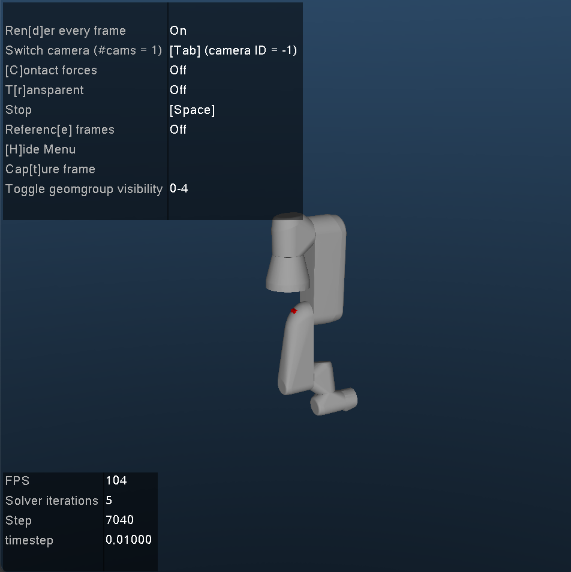

# UR3e Robot Gymnasium Environment

A Gymnasium environment for the Universal Robots UR3e robotic arm using MuJoCo physics simulation. This environment allows for reinforcement learning and control experiments with the UR3e robot.



## Features

- Full UR3e robot simulation with accurate physics using MuJoCo
- Compatible with the Gymnasium interface for reinforcement learning
- Configurable action and observation spaces
- Customizable reward functions
- Human-readable rendering for visualization

## Installation

To install the UR3e environment, run the following commands:

```bash
git clone https://github.com/yourusername/UR3e.git
cd UR3e
pip install -e .
```

### Prerequisites

- Python 3.7+
- MuJoCo 2.1.0+
- Gymnasium

Install dependencies with:

```bash
pip install gymnasium mujoco
```

## Usage

Basic example of using the environment:

```python
import gymnasium as gym
from gymnasium.envs.registration import register

# Register the environment
register(
    id="gymnasium_env/ur3e-v0",
    entry_point="gymnasium_env.envs.ur3e_env:UR3eEnv"
)

# Create environment
env = gym.make("gymnasium_env/ur3e-v0", render_mode="human")

# Run simulation
obs, info = env.reset()
for _ in range(1000):
    action = env.action_space.sample()
    obs, reward, terminated, truncated, info = env.step(action)
    if terminated or truncated:
        obs, info = env.reset()
env.close()
```

## Environment Details

- **Observation Space**: Joint positions and velocities
- **Action Space**: Joint torques within defined limits
- **Reward Function**: Currently based on joint positions and velocities
- **Terminal Conditions**: Customizable based on task requirements

## Customization

The environment can be customized by modifying the reward function, terminal conditions, or robot model parameters in the `ur3e_env.py` file.

## Contributing

Contributions are welcome! Please feel free to submit a Pull Request.

1. Fork the repository
2. Create your feature branch (`git checkout -b feature/AmazingFeature`)
3. Commit your changes (`git commit -m 'Add some AmazingFeature'`)
4. Push to the branch (`git push origin feature/AmazingFeature`)
5. Open a Pull Request

## License

This project is licensed under the MIT License - see the LICENSE file for details.

## Acknowledgments

- [Gymnasium](https://gymnasium.farama.org/) for the reinforcement learning framework
- [MuJoCo](https://mujoco.org/) for the physics simulation
- [Universal Robots](https://www.universal-robots.com/) for the UR3e robot specifications

