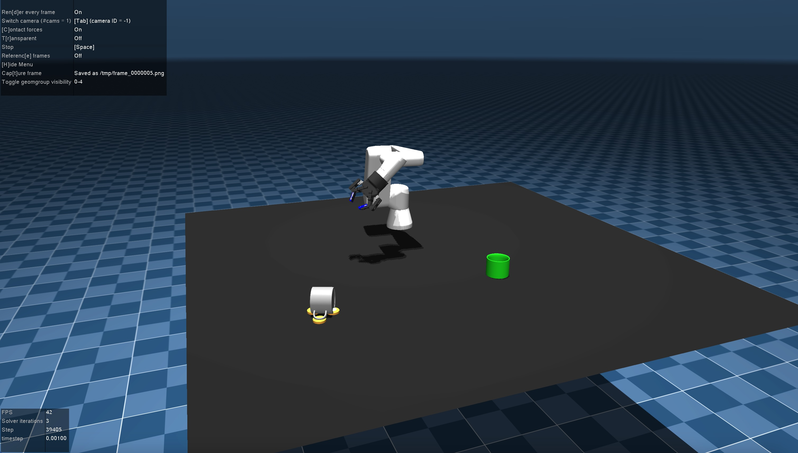

# UR3e Robot Gymnasium Environment



## Installation

To install the UR3e environment, run the following commands:

```bash
git clone https://github.com/yourusername/UR3e.git
cd UR3e
pip install -e .
```

### Prerequisites

- Python 3.7+
- MuJoCo 2.1.0+
- Gymnasium


